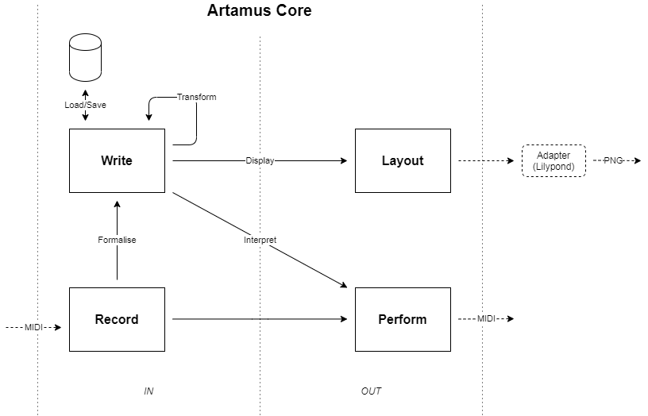

**Artamus** is a music analysis client/server application.

#### Background
For quite some years I've been thinking about what Photoshop for symbolic music (that is, sheet music) would look like.

Furthermore I wanted to further develop my scala skills, so I wanted to use as few libraries as possible, write the program from scratch and just see how far I would get.

Thus **Artamus** was born. This repository represents the current state of the project. 

#### Core

Artamus core contains the main data structures and operations. It's design is outlined in the diagram.


##### Packages
The application is separated into several packages to keep concerns separated
- **Client** Contains the client application with the input and viewing logic
- **Server** Contains the application state and does the heavy lifting
- **Common** Contains the core and some shared packages
- **Network** Contains socket communication (which might be split off entirely into a separate package eventually)
- **Storage** Contains a lightweight memory/file storage (which might be split off entirely into a separate package eventually)

```
Dependency overview:
PACKAGE      DEPENDENCIES
client       [common.domain, common.patching, common.pubsub, network]
server       [common.domain,                  common.pubsub, network, storage]
```

The server application requires `Lilypond` which can be downloaded at:
http://lilypond.org/download.html


#### Keyboard reference

```
                 ^                   client.midi
                 |  pc   step   ^2   oct4
.----------------|
|    .===========|  0    0      1    60
>----|XXXXXXXXXXX|  1           2    61
|    >===========|  2    1      4    62
>----|XXXXXXXXXXX|  3           8    63
|    `===========|  4    2      16   64
>----------------|
|    .===========|  5    3      32   65
>----|XXXXXXXXXXX|  6                66
|    >===========|  7    4           67
>----|XXXXXXXXXXX|  8                68
|    >===========|  9    5           69
>----|XXXXXXXXXXX|  10               70
|    `===========|  11   6           71
>----------------|
|                |  0    0           72
`----------------|
                 |
                 v
```