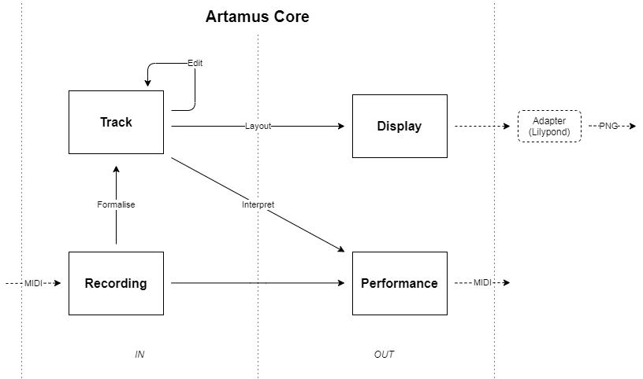

**Artamus** is a music analysis client/server application.

### Background
For quite some years I've been thinking about what Photoshop for symbolic music (that is, sheet music) would look like. What would it mean to manipulate musical symbols in a meaningful way, and be able to let the computer assist you in making musical decisions.

After a couple of failed attempts in other languages I decided I wanted to further develop my scala skills, and I might as well give the project a new try. To make for an optimal learning experience I decided to use as few libraries as possible, write the program from scratch and just see how far I would get.

Thus **Artamus** was born. 

### Structure

The application is separated into several subprojects and packages:
- **artamus-client** Contains a client application with input and viewing logic
- **artamus-core** Contains the music domain: the data structures and operations that transform them.
- **artamus-server** Contains a server application that does the calculations.
- **common** Contains some smaller common packages
- **network** Contains socket communication (which might be replaced/split off)
- **storage** Contains a lightweight memory/file storage (which might be replaced/split off)

#### artamus-core

Artamus core contains the main data structures and operations. It's design is outlined in the diagram below.

The blocks represent the separate data models, the arrows represent the transformations on and between them and correspond to the package structure in core.

#### Requirements

The server application requires `Lilypond` which can be downloaded at:
http://lilypond.org/download.html

[Keyboard Reference](docs.keyboard.md)
